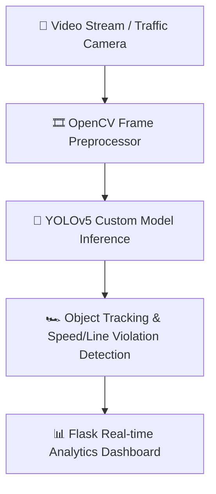

# SafeCity AI 🚦

<div align="center">
  <h3>YOLOv5 Automated Traffic Safety & Violation Monitoring</h3>
  <p><em>Surveillance Automatisée du Trafic & Infractions par YOLOv5</em></p>

  <br />
  
  <!-- Demonstration Banner -->
  <div style="border: 1px solid rgba(255,255,255,0.2); border-radius: 12px; padding: 10px; background: rgba(0,0,0,0.5);">
    
    <p><sub>🎬 <b>Demonstration / Aperçu Visuel :</b> Remplacez <code>preview.gif</code> par la vraie démo animée du projet.</sub></p>
  </div>

  <br />
     
</div>

---

<details open>
  <summary><b>📌 Table of Contents / Table des matières</b></summary>
  <ul>
    <li><a href="#-english">🇬🇧 English</a></li>
    <ul>
      <li><a href="#-about-the-project">About the Project</a></li>
      <li><a href="#-architecture--data-flow">Architecture & Data Flow</a></li>
      <li><a href="#-key-features">Key Features</a></li>
      <li><a href="#-getting-started">Getting Started</a></li>
    </ul>
    <li><a href="#-français">🇫🇷 Français</a></li>
    <ul>
      <li><a href="#-à-propos-du-projet">À propos du projet</a></li>
      <li><a href="#-architecture--flux-de-données">Architecture & Flux de données</a></li>
      <li><a href="#-fonctionnalités-clés">Fonctionnalités clés</a></li>
      <li><a href="#-démarrage-rapide">Démarrage rapide</a></li>
    </ul>
    <li><a href="#-license--licence">📜 License / Licence</a></li>
  </ul>
</details>

---

## 🇬🇧 English

### 📖 About the Project
SafeCity AI is an automated real-time computer vision system powered by a custom-trained YOLOv5 model and OpenCV to track vehicles, detect traffic violations, and visualize traffic analytics on a web dashboard.

### 🏗️ Architecture & Data Flow


### ✨ Key Features
- 🚗 **Real-Time Tracking**: Deep learning object detection & multi-class vehicle tracking
- 🚦 **Violation Detection**: Automated alerts for speeding, illegal turns, and lane drift
- 🎥 **Video Stream Processing**: Multi-camera RTSP/MP4 video stream handling
- 📊 **Flask Web Dashboard**: Interactive analytics with real-time video overlay

### 💻 Getting Started
To install and run this project locally:
```bash
run_safecity.bat
```

---

## 🇫🇷 Français

### 📖 À propos du projet
SafeCity AI est un système de vision par ordinateur en temps réel propulsé par un modèle YOLOv5 entraîné sur-mesure et OpenCV pour suivre les véhicules, détecter les infractions et afficher les métriques sur un tableau de bord web.

### 🏗️ Architecture & Flux de données


### ✨ Fonctionnalités clés
- 🚗 **Suivi Temps Réel**: Détection d'objets Deep Learning et suivi multi-classes de véhicules
- 🚦 **Détection d'Infractions**: Alertes automatiques de vitesse et franchissements de lignes
- 🎥 **Traitement de Flux Vidéo**: Ingestion vidéo multi-flux (RTSP, MP4)
- 📊 **Tableau de Bord Flask**: Supervision analytique avec incrustation vidéo en direct

### 💻 Démarrage rapide
Pour installer et lancer ce projet localement :
```bash
run_safecity.bat
```

---

## 📜 License / Licence
Distributed under the MIT License. Copyright © 2026 **Ricardo Ratovoarisoa**. All rights reserved.

---
<div align="center">
  <sub>Built with ❤️ by <b>Ricardo Ratovoarisoa</b> | AI & Full-Stack Developer</sub>
</div>
